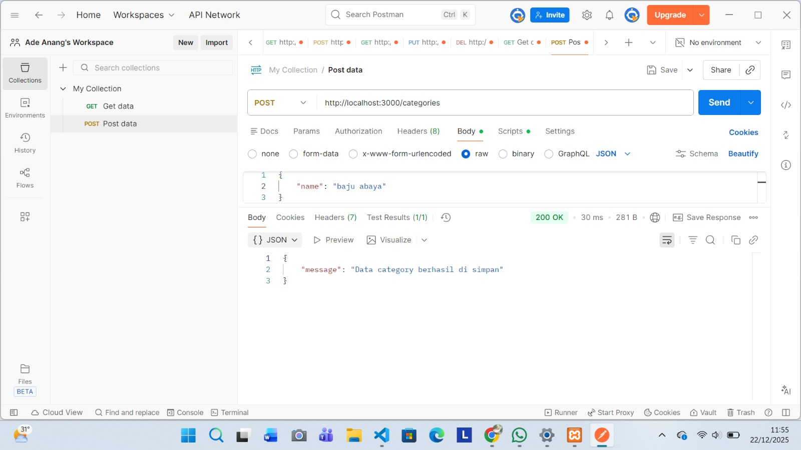
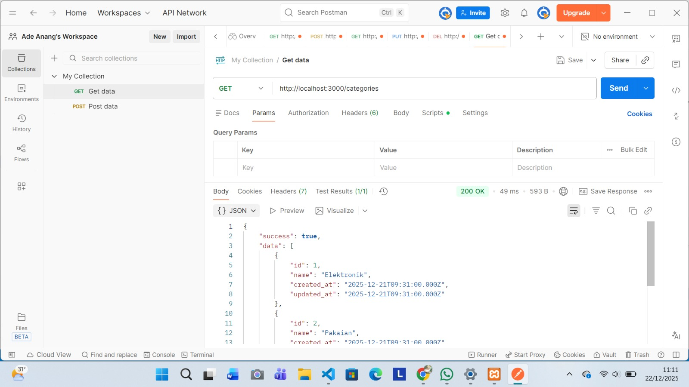
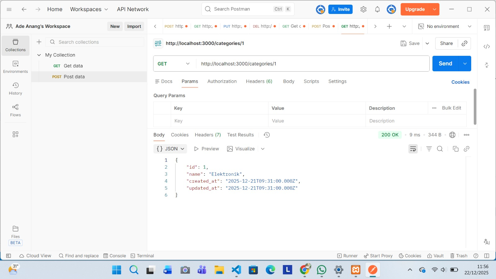
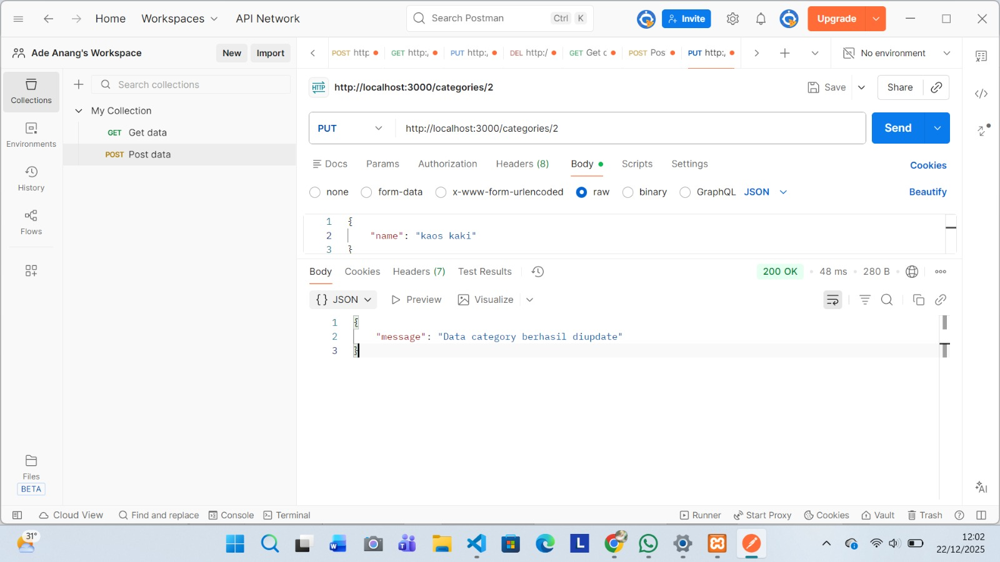
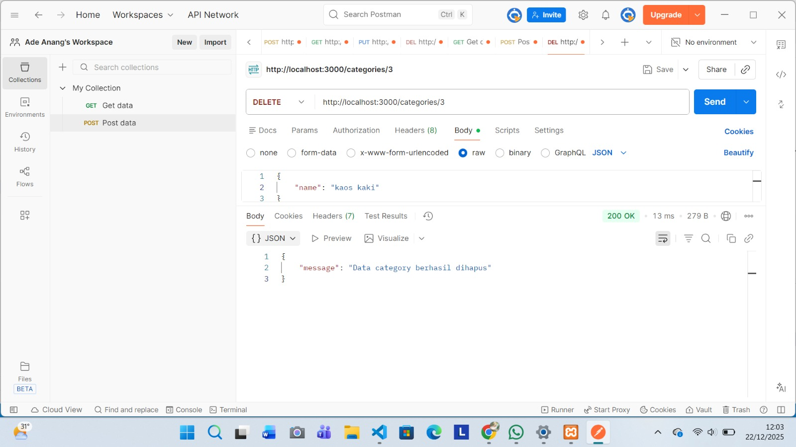
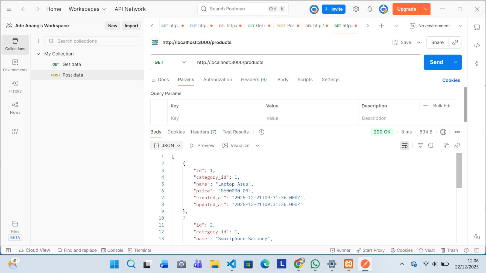
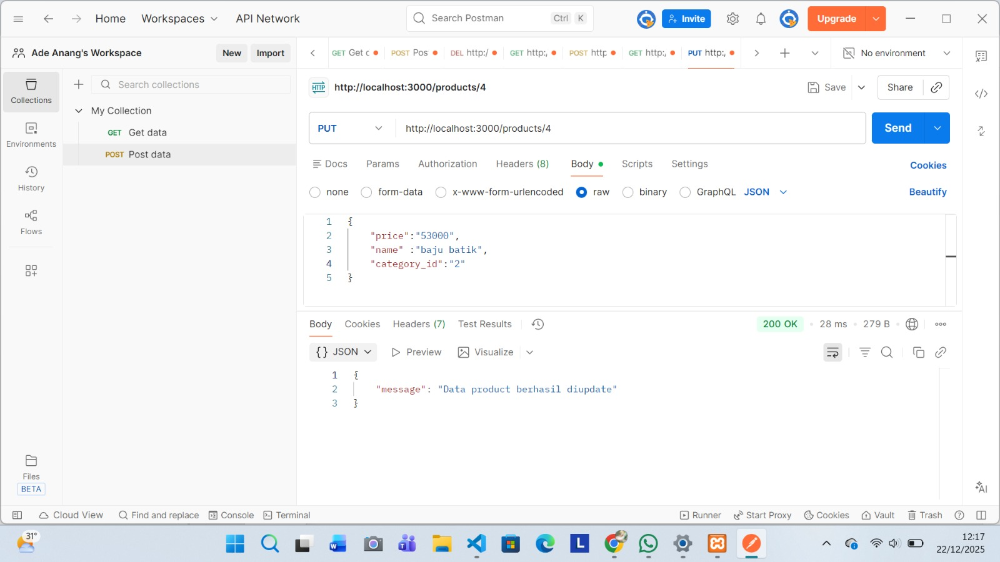
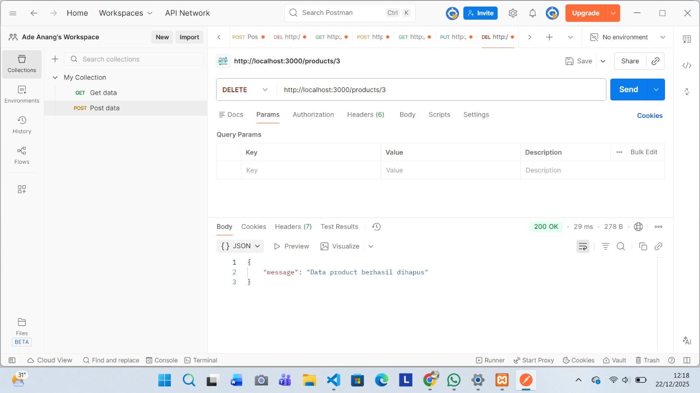

# Backend REST API – User, Category, Product

Project ini merupakan backend REST API sederhana menggunakan Node.js, Express, dan MySQL.

---

## A. Instalasi MySQL dan Tools

- XAMPP / MAMP / WAMP
- MySQL Server
- MySQL Workbench / phpMyAdmin

---

## B. Instalasi Project
### 1. Clone Repository
```bash
git clone <https://github.com/Adeanang/nodejs-crud-restapi.git> 
```
### 2. Masuk ke Folder Project
```bash 
cd nama-project
```
### 3. Inisialisasi Project
```bash 
npm init -y
```
## C. Instalasi ExpressJS
```bash 
npm install express
```
## D. Pembuatan Database yang berisi
1. Tabel Users
2. Tabel Categories
3. Tabel Products
## E. Instalasi MySQL Driver
```bash 
npm install mysql
```
## F. Environment Variable (.env)
### 1. Instal dotenv
```bash 
npm install dotenv
```
### 2. Buat File .env
```bash 
PORT=3000
DB_HOST=localhost
DB_USER=root
DB_PASSWORD=
DB_NAME=users
```
## G. Menjalankan Server
### 1. Instal Nodemon
```bash 
npm install -D nodemon
```
### 2. Edit Script package.json
"scripts": {
    "dev": "nodemon server.js"
    }
### 3. Jalankan Server
```bash 
npm run dev 
```

### I. Pengujian API Menggunakan Postman
Pastikan server sudah berjalan: http://localhost:3000

##  CATEGORY API

### Create Category (Tambah Data Category)
- Method: **POST**
- URL: http://localhost:3000/categories

- Pilih tab **Body**
- Pilih **raw**
- Pilih format **JSON**
- Masukkan data:
```json
{
  "name": "Baju abaya"
} 
```
- Pilih Klik Send, Jika berhasil, akan muncul response data category berhasil ditambahkan.


### Get All Categories (Lihat Semua Category)
- Method: **GET**
- URL: http://localhost:3000/categories

- Pilih Klik Send, Jika berhasil, Akan menampilkan seluruh data category dalam bentuk array JSON.


### Get Categories berdasarkan id
- Method: **GET**
- URL: http://localhost:3000/categories/1  

- Pilih Klik Send, Jika berhasil, Akan menampilkan  data category dengan id "1" dalam bentuk array JSON.


### Update Category berdasarkan id
- Method: **PUT**
- URL: http://localhost:3000/categories/2  (angka 2 merupakan id kategori yang akan diupdate)

- Pilih tab **Body**
- Pilih **raw**
- Pilih format **JSON**
- Pilih Klik Send, Jika berhasil, akan muncul pesan Kategori berhasil diupdate.


### Delete Category berdasarkan id
- Method: **DELETE**
- URL: http://localhost:3000/categories/2  (angka 2 merupakan id kategori yang akan dihapus)
- Pilih Klik Send, Jika berhasil, maka category akan terhapus dari database.


##  PRODUCT API

### Create Product (Tambah Data Product)
- Method: **POST**
- URL: http://localhost:3000/products

- Pilih tab **Body**
- Pilih **raw**
- Pilih format **JSON**
- Masukkan data:
```json
{
  "name": "buku",
  "price": 800.000,
  "category_id": 2
}
```
- Pilih Klik Send, Jika berhasil, akan muncul response data product yang ditambahkan.


### Get All Product (Lihat Semua Product)
- Method: **GET**
- URL: http://localhost:3000/products

- Pilih Klik Send, Jika berhasil, Akan menampilkan seluruh data product dalam bentuk array JSON.


### Get Product berdasarkan id
- Method: **GET**
- URL: http://localhost:3000/products/2 

- Pilih Klik Send, Jika berhasil, Akan menampilkan data product id "2" dalam bentuk array JSON.


### Update products berdasarkan id
- Method: **PUT**
- URL: http://localhost:3000/products/4  (angka 4 merupakan id product yang akan diupdate)

- Pilih tab **Body**
- Pilih **raw**
- Pilih format **JSON**
- Pilih Klik Send, Jika berhasil, akan muncul pesan product berhasil diupdate.


### Delete product berdasarkan id
- Method: **DELETE**
- URL: http://localhost:3000/products/3  (angka 3 merupakan id product yang akan dihapus)
- Pilih Klik Send, Jika berhasil, maka Product akan terhapus dari database.



